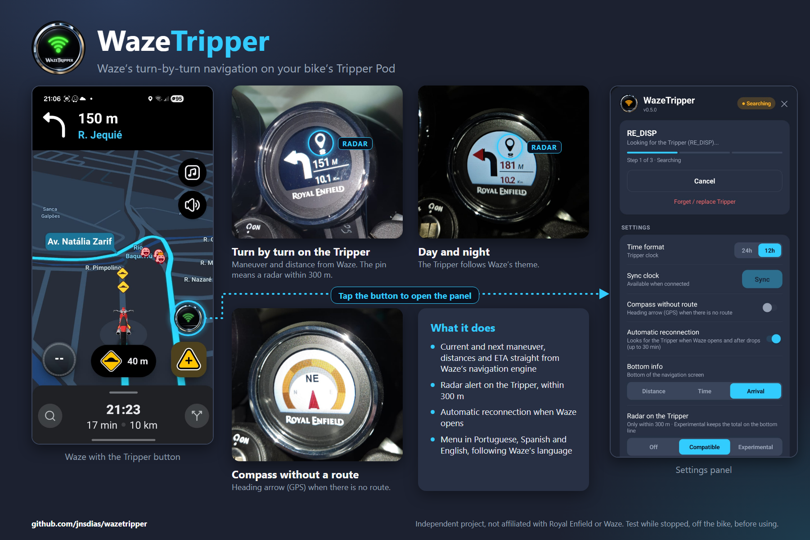

# WazeTripper

<p align="center"></p>

**English** · [Português (Brasil)](README.pt-BR.md)

WazeTripper makes the **Royal Enfield Tripper Pod** (the small navigation display of the Meteor 350) show the
turn-by-turn directions of **Waze**, over Bluetooth, with no extra app. You build a modified copy of the Waze app for
your own phone; the Tripper then shows the next turns, distances, ETA and speed-camera alerts straight from Waze.

> **Which Tripper?** Royal Enfield has two products with "Tripper" in the name: the **Tripper Pod** (the compact
> display, seen over Bluetooth as `RE_DISP`) and the **Tripper Dash** (a different device). **This project is only for
> the Tripper Pod.** The Dash is not supported and was never tested. From here on, "Tripper" means the Tripper Pod.



**Read this first.** This is an experimental hobby project. Set everything up while stopped, test it off the bike, and
**do not operate the app while riding**. Modifying Waze likely violates its Terms of Service: that risk is yours, on
your own device and account. It was tested on a single setup (see [Status](#status)).

## Quick start

### What you need

- A computer with **Docker**: Windows 10/11 (Docker Desktop with WSL2), macOS or Linux. About **6 GB** of free disk and
  **5 to 20 minutes** the first time (mostly downloads: about 1.5 GB of tools and 150 MB of Waze).
- An **Android phone** and a USB cable.
- To use it on the road, a Royal Enfield with a Tripper Pod. You can build and install without the bike.

<details>
<summary><b>Windows: one-time setup</b></summary>

1. Open PowerShell **as administrator** and run `wsl --install`, then restart the PC. This installs Ubuntu; open the
   **Ubuntu** app once to finish creating your user.
2. Install [Docker Desktop](https://www.docker.com/products/docker-desktop/), start it, and under
   *Settings > Resources > WSL integration* turn on **Ubuntu**.
3. Run every command below in the **Ubuntu** terminal, in your home folder (not under `C:\`, which is much slower).

</details>

### 1. Get the code

```bash
git clone https://github.com/jnsdias/wazetripper.git
cd wazetripper
```

No `git`? On the GitHub page click *Code > Download ZIP*, unzip it and open a terminal in that folder.

### 2. Build the APK

```bash
bash scripts/build-image.sh     # once: prepares the build tools inside Docker
bash scripts/all.sh             # downloads Waze, patches it and builds the APK
```

When it finishes, `wazetripper.apk` (about 145 MB) is in the folder. It is the official Waze, downloaded by the script,
plus WazeTripper, signed with a key created on your machine. **Do not share this APK**: it contains Waze.

### 3. Install it on the phone

First **uninstall the official Waze** from the phone. The signature of your build is different, so Android will not
install it over the official one (you will sign in to Waze again afterwards).

**Option A, without `adb`:**
1. Copy `wazetripper.apk` to the phone with the USB cable, in *File transfer* mode. On Windows, run
   `explorer.exe .` in the Ubuntu terminal to open the folder where the file is.
2. On the phone, open the file with the *Files* app and tap it. Allow *install unknown apps* for that app when Android
   asks, then install.

**Option B, with `adb`:**
1. On the phone: *Settings > About phone*, tap *Build number* 7 times, then in *Settings > Developer options* turn on
   **USB debugging**. Connect the cable and accept the *Allow USB debugging?* prompt.
2. Install the [Android platform-tools](https://developer.android.com/tools/releases/platform-tools) on your computer.
3. Check with `adb devices` (the phone must be listed as `device`), then install:

   ```bash
   adb install wazetripper.apk
   ```

   On Windows, `adb` runs in **PowerShell**, not in Ubuntu. Copy the file to your Downloads folder from Ubuntu with
   `cp wazetripper.apk /mnt/c/Users/YOUR_USER/Downloads/`, then in PowerShell run
   `adb install "$HOME\Downloads\wazetripper.apk"`.

### 4. First use

1. Turn the bike on and open the patched Waze. Tap the round **Tripper button** on the right side of the map to open the
   panel (the panel follows Waze's language: Portuguese, Spanish, or English for any other language).
2. First time: tap **Connect**, type the PIN shown on the Tripper, confirm. The pairing is saved.
3. After that, the app looks for the Tripper by itself when Waze starts. Start a route in Waze and the maneuvers flow to
   the Tripper.

The Tripper only advertises for a short time after the ignition is turned on. If you turned the bike on *before*
opening Waze and it does not connect, turn the ignition off and on again with Waze open.

### If something goes wrong

| Problem | What to do |
|---|---|
| `docker: command not found` or `Cannot connect to the Docker daemon` | Start Docker Desktop. On Windows, turn on Ubuntu under *Settings > Resources > WSL integration*. |
| The Waze download fails | Run `bash scripts/all.sh` again. It skips what is already done. |
| `adb devices` shows nothing, or `unauthorized` | Check that USB debugging is on, that the cable is in *File transfer* mode, and accept the prompt on the phone. |
| `INSTALL_FAILED_UPDATE_INCOMPATIBLE` or "conflicts with an existing package" | Uninstall the official Waze first (step 3). |
| `INSTALL_FAILED_INSUFFICIENT_STORAGE` | Free some space on the phone. |
| The Tripper is not found | Turn the ignition off and on again with Waze open. |

Anything else: [open an issue](https://github.com/jnsdias/wazetripper/issues). Advanced settings (Waze version,
download source, languages) are in `.env.example`; you do not need it for a normal build.

## What it does

- A floating **Tripper button** in Waze opens the connection panel. Its Wi-Fi symbol is red when disconnected, orange
  while connecting and green when connected.
- Pairs with the Tripper's PIN and reconnects on its own when Waze starts and after a dropped link.
- Navigation: current maneuver, **next maneuver**, distances, roundabout exit, and a bottom line you choose (total
  distance, time remaining or arrival time, in 12h or 24h).
- **Radar alerts** (cameras, average-speed zones) on the Tripper when within 300 m, shown as a small pin.
- Day/night follows Waze's theme. Without a route: the Tripper's clock, or a GPS compass.
- **Trip logs**: each navigation can be exported from the panel, to check which icons were wrong or missing.

## Status

| | |
|---|---|
| Version | `0.5.1` (see [`CHANGELOG.md`](CHANGELOG.md)) |
| Tested on | Royal Enfield Meteor 350 Tripper Pod, Waze **5.23.0.2**, Samsung Galaxy S23 |
| Waze version | Only **5.23.0.2**. The patches depend on names that change between Waze releases. |
| Verified on hardware | the link and navigation stay alive with Waze minimized and the screen locked; automatic reconnection; the radar icon |
| Not yet verified on hardware | route-started and recalculating screens, the call icon, distance-based icon intensity, and going back to the Tripper's clock through the automatic reconnection |

Other bikes, phones and Waze versions are untested.

## More

### Trip logs

While Waze is navigating, WazeTripper writes a log of that trip to the app's private storage (the latest 30 trips or
about 10 MB). In the panel, **Export** saves them to `Downloads/WazeTripper/` and opens the Android share sheet.

**What is in the file:** timestamps; the Waze maneuver names and the Tripper bytes sent; distances, ETA and radar
events; Bluetooth connection events (which can include your Tripper's Bluetooth address); the app, Waze and Android
versions and your phone model. **Route coordinates are never written.** Read the file before sending it to anyone.

### Helping to test

Testing needs your own APK (see [Quick start](#quick-start)); please do not share built APKs. After a ride, export the
log and open an issue using the *Trip log report* template, or send it privately to the maintainer. Reports of
maneuvers that show a wrong icon, or no icon, are especially useful (look for `sem traducao pro Tripper` lines).

### Known limitations

- Only Waze 5.23.0.2. The Tripper protocol is only partly documented (see the open questions in
  [`docs/PROTOCOL.md`](docs/PROTOCOL.md)).
- Going back to the Tripper's clock (compass turned off, route ended) is not clean yet: the Tripper drops the link a few
  seconds after a screen stops being re-sent, and the automatic reconnection brings it back, already on its clock.
- The *Experimental* radar mode is an unverified hypothesis, and the meaning of Waze's "enforcement zone" value is not
  known yet. Details in [`docs/PROTOCOL.md`](docs/PROTOCOL.md).

### How it works, and where to read more

WazeTripper decompiles Waze, injects a few hooks (startup and navigation callbacks), compiles a small Java package
([`src/com/waze/wazetripper/`](src/com/waze/wazetripper)) and grafts it in, then re-signs the result, all inside a
Docker image and without recompiling Waze's resources. The Tripper protocol was worked out independently, by observing
a real Tripper and by interoperability analysis of existing Tripper apps.

- [`docs/DEVELOPMENT.md`](docs/DEVELOPMENT.md): the full build mechanism, the architecture and the packet checks
  (`scripts/framecheck.sh` checks every packet sent to the Tripper without any hardware, and gates the build).
- [`docs/PROTOCOL.md`](docs/PROTOCOL.md): the Tripper's BLE protocol, with a confidence level for each value.
- [`CHANGELOG.md`](CHANGELOG.md) lists what changed in each version, and [`NOTICE.md`](NOTICE.md) has the credits.

## Disclaimer

Not affiliated with, endorsed by, or connected to Waze, Google, or Royal Enfield. "Waze", "Royal Enfield", "Tripper Pod" and "Tripper Dash"
are trademarks of their respective owners, referenced here only to describe compatibility.

This repository contains no Waze or Royal Enfield code, assets, or data. It ships a build pipeline and a small
injected package that run against your own, legitimately downloaded copy of Waze, which `fetch-apk.sh` fetches at build
time. Nothing proprietary is redistributed, and the APK you build must **not** be redistributed either. The Tripper
BLE protocol was worked out independently for interoperability, not taken from Royal Enfield documentation or source.

## License

[Apache-2.0](LICENSE)

The license covers only this repository's own code: the build pipeline and the injected `com.waze.wazetripper`
package. It does not, and cannot, license any Waze or Royal Enfield material. See the [Disclaimer](#disclaimer).

Built on top of **[wazeology](https://github.com/agstrc/wazeology)** by agstrc (Apache-2.0), which provides the
patching approach and the build pipeline this project reuses. See [`NOTICE.md`](NOTICE.md).
