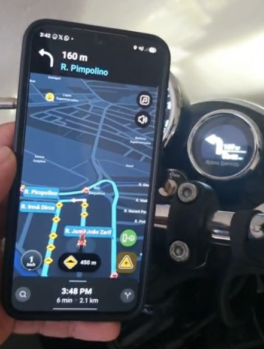

# WazeTripper

**English** · [Português (Brasil)](README.pt-BR.md)

Patch the Waze Android app to drive a **Royal Enfield Tripper Pod** (the navigation display of the Meteor 350) over
Bluetooth Low Energy — no companion app, no Google Maps notification scraping. Turn-by-turn maneuvers, the *next*
maneuver, distances, ETA and speed-camera alerts come straight from Waze's own navigation engine.

> **Which Tripper?** Royal Enfield has two products with "Tripper" in the name: the **Tripper Pod** (the compact
> navigation display, seen over Bluetooth as `RE_DISP`) and the **Tripper Dash** (a different device, with its own
> hardware and, as far as we could tell, its own protocol). **This project is only for the Tripper Pod.** The Dash is
> not supported and was never tested. From here on, "Tripper" always means the Tripper Pod.



## Table of Contents

- [Security](#security)
- [Background](#background)
  - [Status](#status)
  - [Features](#features)
  - [See Also](#see-also)
- [Install](#install)
  - [Dependencies](#dependencies)
- [Usage](#usage)
  - [Trip logs](#trip-logs)
  - [Helping to test](#helping-to-test)
  - [Known limitations](#known-limitations)
- [Disclaimer](#disclaimer)
- [License](#license)

## Security

This project drives a motorcycle's instrument display. Set everything up while stopped and test it off the bike
before you rely on it while riding; **do not operate the app while riding**.
`scripts/framecheck.sh` checks the byte layout of every packet sent to the Tripper without any hardware (it includes
packets captured from a real Tripper and gates the build), and the in-app **Detalhes** log and the trip logs show what
was sent. Once you do ride with it, treat it like any other gauge and keep your eyes on the road.

Modifying Waze likely violates its Terms of Service. That risk is yours to take, on your own device and your own
account, and nothing here can waive it for you. Use it at your own risk.

## Background

This is an experimental, unofficial hobby project for your own devices, published for study. You bring your own copy
of Waze and your own hardware. Waze is decompiled, a few smali hooks are injected (startup and navigation callbacks),
a small Java package ([`src/com/waze/wazetripper/`](src/com/waze/wazetripper)) is compiled and grafted in, and the
result is re-signed — all inside a Docker image, without recompiling Waze's resources. The Java side speaks the
Tripper's BLE protocol ([`docs/PROTOCOL.md`](docs/PROTOCOL.md)).

The Tripper protocol was worked out independently, by observing a real Tripper and by interoperability analysis of
existing Tripper apps. Only one setup is confirmed so far (below); other bikes, phones and Waze versions are untested.

### Status

| | |
|---|---|
| Version | `0.4.2` (see [`CHANGELOG.md`](CHANGELOG.md)) |
| Tested on | Royal Enfield Meteor 350 Tripper Pod · Waze **5.23.0.2** · Samsung Galaxy S23 |
| Waze version | Only **5.23.0.2**. The hooks use obfuscated names that change between Waze releases. |
| Verified on hardware | link and navigation stay alive with Waze minimized and the screen locked; automatic reconnection; radar icon `0x3C` |
| Not yet verified on hardware in 0.4.x | route-started / recalculating screens, call icon, distance intensity, going back to the Tripper's clock through the automatic reconnection |
| Older, still unverified | trip logging/export |

### Features

- Runs **inside** the patched Waze: a floating motorbike button opens a connection panel.
- Pairing with the Tripper's PIN, then reconnection to the known Tripper (automatic on Waze start and after a
  dropped link, for up to 30 minutes; can be turned off).
- Navigation: current maneuver, **next maneuver** (small arrow), distance, roundabout exit, and a bottom line you
  choose — total distance, time remaining or arrival time (12h/24h).
- Radar alerts (camera alerts, average-speed zones, enforcement zones) shown on the Tripper when within 300 m, with a
  setting to turn it off or pick the encoding.
- Day/night follows Waze's theme. Route-started and recalculating screens, a call icon while the phone rings, and
  distance-based icon intensity.
- Without a route: the Tripper's native clock, or a GPS compass. Clock sync and 12h/24h setting.
- **Trip logs**: each navigation is recorded to a file you can export from the panel, to check which icons were
  wrong or missing.

### See Also

- [`DEVELOPMENT.md`](docs/DEVELOPMENT.md) covers the full fetch, decompile, patch, graft and signing mechanism, the
  architecture, and how to extend the packet checks.
- [`PROTOCOL.md`](docs/PROTOCOL.md) documents the Tripper's BLE protocol, with a confidence level for each value.
- [`CHANGELOG.md`](CHANGELOG.md) lists what changed in each version, and [`NOTICE.md`](NOTICE.md) has the credits.

## Install

WazeTripper builds through the scripts in `scripts/`. The only thing you install on the host is Docker; the whole
Android toolchain runs inside a pinned image.

### Dependencies

- **Docker**, on a machine that can run it (Linux, macOS, or Windows + WSL2).
- An Android phone to sideload the built APK on, and `adb` (or a file manager) to install it.
- A network connection for the first build: `scripts/fetch-apk.sh` downloads Waze **5.23.0.2** with
  [apkeep](https://github.com/EFForg/apkeep) (APKPure by default; Google Play with an account is also supported —
  see `.env.example`). The APK is never committed.

```bash
cp .env.example .env        # optional; defaults are fine
scripts/build-image.sh      # once: builds the toolchain image
scripts/all.sh              # fetch Waze 5.23.0.2 -> decompile -> patch -> framecheck -> build
# result: ./wazetripper.apk
scripts/framecheck.sh       # off-bike packet byte-layout test (build.sh also runs it as a gate)
```

The APK is signed with a local debug key created on the first build. Because that differs from the Play Store's
signature, **uninstall the official Waze first** (sign in again afterwards), then sideload:

```bash
adb install ./wazetripper.apk
```

## Usage

1. Turn the bike on, open the patched Waze, tap the floating motorbike button (the app's own UI is in Portuguese).
2. First time: tap **Conectar**, type the PIN shown on the Tripper, confirm. The pairing is saved.
3. After that, the app looks for the known Tripper by itself when Waze starts. Start a Waze route and the maneuvers
   flow to the Tripper.

Note: the Tripper only advertises for a short time after the ignition is turned on. If you turn the bike on *before*
opening Waze and it does not connect, turn the ignition off and on again with Waze open.

### Trip logs

While Waze is navigating, WazeTripper writes a log of that trip to the app's private storage (the latest 30 trips or
~10 MB). In the panel, **Exportar** saves them to `Downloads/WazeTripper/` and opens the Android share sheet.

**What is in the file:** timestamps; the Waze maneuver names and the Tripper bytes sent; distances, ETA and radar
events; Bluetooth connection events (which can include your Tripper's Bluetooth address); the app, Waze and Android
versions and your phone model. **Route coordinates are never written.** Read the file before sending it to anyone.

### Helping to test

Testing needs your own APK (see [Install](#install)) — please do not share built APKs. After a ride, export the log
and open an issue using the *Trip log report* template, or send it privately to the maintainer. Reports of
maneuvers that show a wrong icon, or no icon, are especially useful (look for `sem traducao pro Tripper` lines).

### Known limitations

- Only Waze 5.23.0.2; the Tripper protocol is only partly documented (see the open questions in
  [`docs/PROTOCOL.md`](docs/PROTOCOL.md)).
- Going back to the Tripper's native clock (compass turned off, route ended) without dropping the link is still being
  worked out: the Tripper drops the link 4–5 s after a screen stops being re-sent, and after such a drop it advertises
  again at once, so the automatic reconnection brings it back a few seconds later (with the clock).
- In *Experimental* radar mode the distance goes in bytes `[8-9]`, which is an unverified hypothesis; if the Tripper
  ignores them only the radar icon shows. *Compatible* mode puts it on the bottom line, hiding the route total.
- The meaning of Waze's "enforcement zone" value is not known yet, so it only lights the radar indicator without a
  distance.

## Disclaimer

Not affiliated with, endorsed by, or connected to Waze, Google, or Royal Enfield. "Waze", "Royal Enfield", "Tripper Pod" and "Tripper Dash"
are trademarks of their respective owners, referenced here only to describe compatibility.

This repository contains no Waze or Royal Enfield code, assets, or data. It ships a build pipeline and a small
injected package that run against your own, legitimately downloaded copy of Waze, which `fetch-apk.sh` fetches at build
time. Nothing proprietary is redistributed, and the APK you build must **not** be redistributed either. The Tripper
BLE protocol was worked out independently for interoperability, not taken from Royal Enfield documentation or source.

## License

[Apache-2.0](LICENSE)

The license covers only this repository's own code: the build pipeline and the injected `com.waze.wazetripper`
package. It does not, and cannot, license any Waze or Royal Enfield material. See the [Disclaimer](#disclaimer).

Built on top of **[wazeology](https://github.com/agstrc/wazeology)** by agstrc (Apache-2.0), which provides the
patching approach and the build pipeline this project reuses. See [`NOTICE.md`](NOTICE.md).
