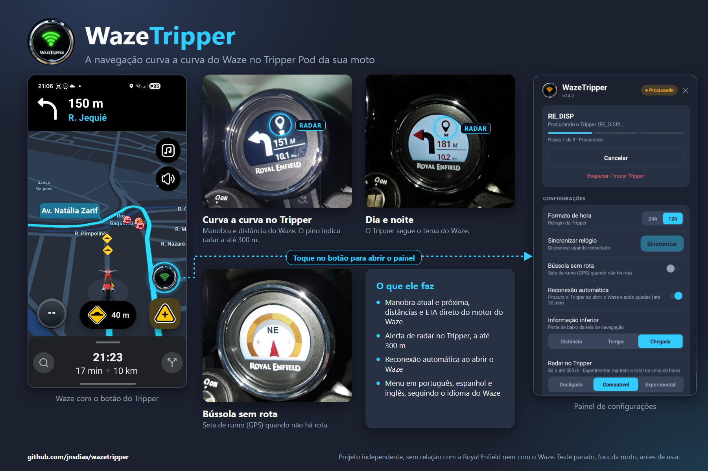

# WazeTripper

<p align="center"></p>

[English](README.md) · **Português (Brasil)**

O WazeTripper faz o **Tripper Pod da Royal Enfield** (o pequeno display de navegação da Meteor 350) mostrar as
indicações curva a curva do **Waze**, por Bluetooth, sem app intermediário. Você monta uma cópia modificada do app
Waze para o seu próprio celular; o Tripper passa a mostrar as próximas curvas, distâncias, ETA e alertas de radar
direto do Waze.

> **Qual Tripper?** A Royal Enfield tem dois produtos com "Tripper" no nome: o **Tripper Pod** (o display compacto, que
> aparece por Bluetooth como `RE_DISP`) e o **Tripper Dash** (outro aparelho). **Este projeto é somente para o Tripper
> Pod.** O Dash não é suportado e nunca foi testado. Daqui em diante, "Tripper" significa o Tripper Pod.



**Leia isto primeiro.** É um projeto de hobby, experimental. Configure tudo parado, teste fora da moto e **não mexa no
app enquanto pilota**. Modificar o Waze provavelmente viola os Termos de Uso dele: esse risco é seu, no seu aparelho e
na sua conta. Só foi testado em uma configuração (veja o [Estado](#estado)).

## Início rápido

### O que você precisa

- Um computador com **Docker**: Windows 10/11 (Docker Desktop com WSL2), macOS ou Linux. Cerca de **6 GB** livres em
  disco e **5 a 20 minutos** na primeira vez (quase tudo é download: uns 1,5 GB de ferramentas e 150 MB do Waze).
- Um **celular Android** e um cabo USB.
- Para usar na estrada, uma Royal Enfield com Tripper Pod. Dá para montar e instalar sem a moto.

<details>
<summary><b>Windows: preparação (uma vez só)</b></summary>

1. Abra o PowerShell **como administrador**, rode `wsl --install` e reinicie o PC. Isso instala o Ubuntu; abra o app
   **Ubuntu** uma vez para terminar de criar o seu usuário.
2. Instale o [Docker Desktop](https://www.docker.com/products/docker-desktop/), abra-o e, em
   *Settings > Resources > WSL integration*, ative o **Ubuntu**.
3. Rode todos os comandos abaixo no terminal do **Ubuntu**, na sua pasta pessoal (não dentro de `C:\`, que é bem mais
   lento).

</details>

### 1. Baixe o código

```bash
git clone https://github.com/jnsdias/wazetripper.git
cd wazetripper
```

Sem `git`? Na página do GitHub clique em *Code > Download ZIP*, descompacte e abra um terminal nessa pasta.

### 2. Monte o APK

```bash
bash scripts/build-image.sh     # uma vez: prepara as ferramentas de montagem dentro do Docker
bash scripts/all.sh             # baixa o Waze, aplica o patch e monta o APK
```

Quando terminar, o `wazetripper.apk` (cerca de 145 MB) estará na pasta. Ele é o Waze oficial, baixado pelo script, mais o
WazeTripper, assinado com uma chave criada no seu computador. **Não compartilhe esse APK**: ele contém o Waze.

### 3. Instale no celular

Primeiro **desinstale o Waze oficial** do celular. A assinatura da sua montagem é diferente, então o Android não
instala por cima do oficial (você entra de novo na conta do Waze depois).

**Opção A, sem `adb`:**
1. Copie o `wazetripper.apk` para o celular com o cabo USB, no modo *Transferência de arquivos*. No Windows, rode
   `explorer.exe .` no terminal do Ubuntu para abrir a pasta onde o arquivo está.
2. No celular, abra o arquivo pelo app *Arquivos* e toque nele. Permita *instalar apps desconhecidos* para esse app
   quando o Android pedir, e instale.

**Opção B, com `adb`:**
1. No celular: *Configurações > Sobre o telefone*, toque 7 vezes em *Número da versão* e, em *Configurações > Opções do
   desenvolvedor*, ative a **Depuração USB**. Conecte o cabo e aceite o aviso *Permitir depuração USB?*.
2. Instale o [Android platform-tools](https://developer.android.com/tools/releases/platform-tools) no computador.
3. Confira com `adb devices` (o celular deve aparecer como `device`) e instale:

   ```bash
   adb install wazetripper.apk
   ```

   No Windows, o `adb` roda no **PowerShell**, não no Ubuntu. Copie o arquivo para a pasta Downloads a partir do Ubuntu
   com `cp wazetripper.apk /mnt/c/Users/SEU_USUARIO/Downloads/` e, no PowerShell, rode
   `adb install "$HOME\Downloads\wazetripper.apk"`.

### 4. Primeiro uso

1. Ligue a moto e abra o Waze modificado. Toque no **botão redondo do Tripper**, no lado direito do mapa, para abrir o
   painel (o painel segue o idioma do Waze: português, espanhol, ou inglês para qualquer outro idioma).
2. Na primeira vez: toque em **Conectar**, digite o PIN mostrado no Tripper e confirme. O pareamento fica salvo.
3. Depois disso, o app procura o Tripper sozinho quando o Waze abre. Inicie uma rota no Waze e as manobras seguem para o
   Tripper.

O Tripper só anuncia por pouco tempo depois de ligar a ignição. Se você ligou a moto *antes* de abrir o Waze e ele não
conectou, desligue e ligue a ignição de novo com o Waze aberto.

### Se algo der errado

| Problema | O que fazer |
|---|---|
| `docker: command not found` ou `Cannot connect to the Docker daemon` | Abra o Docker Desktop. No Windows, ative o Ubuntu em *Settings > Resources > WSL integration*. |
| O download do Waze falha | Rode `bash scripts/all.sh` de novo. Ele pula o que já foi feito. |
| `adb devices` não mostra nada, ou mostra `unauthorized` | Confira se a depuração USB está ativa, se o cabo está em *Transferência de arquivos* e aceite o aviso no celular. |
| `INSTALL_FAILED_UPDATE_INCOMPATIBLE` ou "conflita com um pacote existente" | Desinstale o Waze oficial antes (passo 3). |
| `INSTALL_FAILED_INSUFFICIENT_STORAGE` | Libere espaço no celular. |
| O Tripper não é encontrado | Desligue e ligue a ignição de novo com o Waze aberto. |

Qualquer outra coisa: [abra uma issue](https://github.com/jnsdias/wazetripper/issues). As configurações avançadas
(versão do Waze, origem do download, idiomas) estão no `.env.example`; você não precisa dele para uma montagem normal.

## O que ele faz

- Um **botão do Tripper** flutuante no Waze abre o painel de conexão. O símbolo de Wi-Fi dele fica vermelho
  desconectado, laranja ao conectar e verde conectado.
- Pareia com o PIN do Tripper e reconecta sozinho quando o Waze abre e depois de uma queda do link.
- Navegação: manobra atual, **próxima manobra**, distâncias, saída de rotatória e uma linha inferior à sua escolha
  (distância total, tempo restante ou hora de chegada, em 12h ou 24h).
- **Alertas de radar** (câmeras, zonas de velocidade média) no Tripper a até 300 m, mostrados como um pequeno pino.
- Dia/noite segue o tema do Waze. Sem rota: o relógio do Tripper ou uma bússola por GPS.
- **Logs de trajeto**: cada navegação pode ser exportada pelo painel, para conferir quais ícones apareceram errados ou
  faltaram.

## Estado

| | |
|---|---|
| Versão | `0.5.1` (veja [`CHANGELOG.md`](CHANGELOG.md)) |
| Testado em | Tripper Pod da Royal Enfield Meteor 350, Waze **5.23.0.2**, Samsung Galaxy S23 |
| Versão do Waze | Somente a **5.23.0.2**. Os patches dependem de nomes que mudam entre versões do Waze. |
| Verificado em hardware | o link e a navegação continuam com o Waze minimizado e a tela bloqueada; reconexão automática; o ícone de radar |
| Ainda sem verificação em hardware | telas de rota iniciada e recalculando, o ícone de ligação, a intensidade do ícone por distância e voltar ao relógio do Tripper pela reconexão automática |

Outras motos, celulares e versões do Waze não foram testados.

## Mais informações

### Logs de trajeto

Enquanto o Waze navega, o WazeTripper grava um log daquele trajeto no armazenamento privado do app (os últimos 30
trajetos ou cerca de 10 MB). No painel, **Exportar** salva em `Downloads/WazeTripper/` e abre o compartilhamento do
Android.

**O que vai no arquivo:** horários; os nomes das manobras do Waze e os bytes enviados ao Tripper; distâncias, ETA e
eventos de radar; eventos da conexão Bluetooth (que podem incluir o endereço Bluetooth do seu Tripper); as versões do
app, do Waze e do Android e o modelo do celular. **As coordenadas da rota nunca são gravadas.** Leia o arquivo antes
de enviá-lo a alguém.

### Ajudando a testar

Testar exige o seu próprio APK (veja o [Início rápido](#início-rápido)). Por favor, não compartilhe APKs montados.
Depois de uma viagem, exporte o log e abra uma issue com o modelo *Trip log report*, ou envie em particular ao
mantenedor. Relatos de manobras com ícone errado ou sem ícone são os mais úteis (procure as linhas
`sem traducao pro Tripper`).

### Limitações conhecidas

- Somente Waze 5.23.0.2. O protocolo do Tripper está só parcialmente documentado (veja as questões em aberto em
  [`docs/PROTOCOL.md`](docs/PROTOCOL.md), em inglês).
- Voltar ao relógio do Tripper (bússola desligada, rota encerrada) ainda não é limpo: o Tripper derruba o link alguns
  segundos depois que uma tela deixa de ser reenviada, e a reconexão automática o recupera, já no relógio.
- O modo de radar *Experimental* é uma hipótese não verificada, e ainda não se sabe o significado do valor de "zona de
  fiscalização" do Waze. Detalhes em [`docs/PROTOCOL.md`](docs/PROTOCOL.md).

### Como funciona e onde ler mais

O WazeTripper decompila o Waze, injeta alguns hooks (inicialização e callbacks de navegação), compila um pequeno pacote
Java ([`src/com/waze/wazetripper/`](src/com/waze/wazetripper)) e o enxerta, e reassina o resultado, tudo dentro de uma
imagem Docker e sem recompilar os recursos do Waze. O protocolo do Tripper foi levantado de forma independente,
observando um Tripper de verdade e analisando, para interoperabilidade, apps existentes do Tripper.

- [`docs/DEVELOPMENT.md`](docs/DEVELOPMENT.md) (em inglês): o mecanismo completo de montagem, a arquitetura e as
  verificações de pacotes (o `scripts/framecheck.sh` confere cada pacote enviado ao Tripper sem nenhum hardware e trava
  o build).
- [`docs/PROTOCOL.md`](docs/PROTOCOL.md) (em inglês): o protocolo BLE do Tripper, com o nível de confiança de cada
  valor.
- [`CHANGELOG.md`](CHANGELOG.md) lista o que mudou em cada versão, e [`NOTICE.md`](NOTICE.md) traz os créditos.

## Aviso legal

Sem afiliação, endosso ou ligação com Waze, Google ou Royal Enfield. "Waze", "Royal Enfield", "Tripper Pod" e
"Tripper Dash" são marcas dos respectivos donos, citadas aqui apenas para descrever compatibilidade.

Este repositório não contém código, recursos nem dados do Waze ou da Royal Enfield. Ele traz uma esteira de build e um
pequeno pacote injetado que rodam sobre a sua própria cópia do Waze, obtida de forma legítima e baixada pelo
`fetch-apk.sh` na hora de montar. Nada proprietário é redistribuído, e o APK que você montar **não deve** ser
redistribuído. O protocolo BLE do Tripper foi levantado de forma independente, para interoperabilidade, e não vem de
documentação nem de código da Royal Enfield.

## Licença

[Apache-2.0](LICENSE)

A licença cobre apenas o código próprio deste repositório: a esteira de build e o pacote injetado
`com.waze.wazetripper`. Ela não licencia, e não pode licenciar, nada do Waze nem da Royal Enfield. Veja o
[Aviso legal](#aviso-legal).

Construído sobre o **[wazeology](https://github.com/agstrc/wazeology)**, de agstrc (Apache-2.0), que fornece a
abordagem de patch e a esteira de build reaproveitada aqui. Veja [`NOTICE.md`](NOTICE.md).
